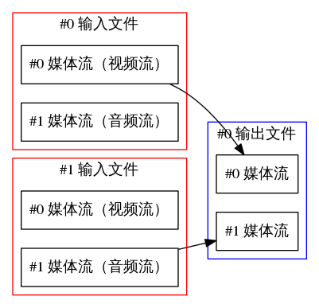

# 不仅能转码

FFmpeg 能够被用来进行简单或复杂的视频转码，可它的功能并不仅限于此。在这一章，我将介绍 FFmpeg 能做的几个实用的工作。

不过值得注意的是，下面涉及的一些概念可能需要较强的逻辑能力，所以请确保前面的章节都已经读过再开始阅读本章。

## 合并两段视频

视频能够被切割，那也能够被合并。这里说的“合并”就是指将视频头尾连接起来，比如我有两段视频，一个是 10 秒，另一个 20 秒，合并起来就是 30 秒。

要合并视频，首先我们得创建一个文本文件，叫什么名字都可以，我这里以 `list.txt` 为例。用任意一种你喜欢的文本编辑器，按顺序逐行写上 `file <file name>` ，比如我要将 `01.mp4` 与 `02.mp4` 合并起来，就写上这些内容：

    file 01.mp4
    file 02.mp4

注意如果文件名包含空格，则必须用单引号将文件名包起来，比如 `file 'file name with space.mp4'` 。我不确定它能不能使用中文的文件名，特别是在[字符集、编码混乱的 Windows](http://www.zhihu.com/question/20650946) 中，所以为了保险起见，尽量使用英文的文件名。

保存好 `list.txt` 之后，就可以在命令行中执行 `ffmpeg -f concat -i list.txt -c copy 输出文件名` 了。如果一切顺利，最后的输出文件就会是 `list.txt` 中所写的文件按顺序连接起来的成果。

这样做有一条限制，那就是被合并的视频必须都是一样编码、一样封装格式的，如果你想合并不同编码的视频，最好先转换成统一的编码。

当然，你也可以用同样的方式合并不止两个视频，要这样做，只要在列表的文本文件中（也就是上述的 `list.txt` ）多写几行就可以了，比如：

    file 'first file.mp4'
    file 'second file.mp4'
    file 'third file.mp4'
    ...

批量处理

命令行工具的一大好处就是它可以很方便地被写进脚本中，以此进行批量处理，在 GNU/Linux 和 Mac OS X 上，你可以创建一个文本文件，随便取个名字，在里面逐行写上想要执行的命令，比如：

    ffmpeg -i a.mp4 a.mkv
    ffmpeg -i b.mp4 b.mkv

之后用 `sh 脚本文件名` 执行这个脚本，它就会依次执行 `ffmpeg -i a.mp4 a.mkv` 和 `ffmpeg -i b.mp4 b.mkv` 两条命令了。

在 Microsoft Windows 中也是如此，不过文件名必须得以 `.bat` 结尾，并且以双击的方式来执行脚本。

你也可以在脚本中使用 “for 循环” 来对许多文件名有规律的媒体文件进行转码，比如像这样（仅限 GNU/Linux 和 Max OS X ）：

    for i in "听爸爸的话 第{01..04}话"; do
        ffmpeg -i "${i}.mkv" -c copy "${i}.mp4"
    done

就会把 “听爸爸的话” 第 01 到 04 话从 MKV 转到 MP4 封装格式。不过因为这东西不属于 FFmpeg 的范畴，所以我在这里不打算详细说明，按照上面的例子生搬硬套也应该能满足大部分需求。

## 自己动手分配媒体流

有时候我们要面对复杂的媒体流分配，比如我有两个视频文件， `a.mp4` 和 `b.mp4` ，我想将 `a.mp4` 的视频流和 `b.mp4` 的音频流提取出来，做成一个新的新视频文件，要怎么做呢？

我可以先用 `ffmpeg -i a.mp4 -c:v copy -an a_video.mp4` 将 `a.mp4` 的视频流单独提取到一个文件上，叫 `a_video.mp4`。
然后用 `ffmpeg -i b.mp4 -c:a copy -vn b_audio.aac` 将 `b.mp4` 的音频流单独提取到 `b_audio.aac` 上。
最后用 `ffmpeg -i a_video.mp4 -i b_audio.aac -c copy final.mp4` 将 `a_video.mp4` 和 `b_audio.aac` 放到一起得到最后的成果 `final.mp4` 。

可是这样需要 3 个步骤，还会产生临时文件。实际上，我们还可以使用手动分配媒体流的方式，用一条命令完成。

这时就要用到 `-map` 选项了，一旦你使用了这个选项， FFmpeg 就不会自动为你将输入文件的媒体流分配到输出文件上，相对的，你可以手动分配。 `-map` 选项的参数是 `输入文件编号:这个文件的媒体流编号` ，指定一次即代表这个媒体流会被分配到输出文件中，比如 `-map 0:0` 将会指定 0 号输入文件的 0 号媒体流（注意编号是以 0 开始计数！）。

`-map` 选项可以指定多次，从而依次指定输出的媒体流顺序，也就是说，第一次 `-map` 指定的媒体流将会变成输出文件的 0 号媒体流，第二次 `-map` 就会指定输出文件的 1 号媒体流，以此类推。举个例子，如果写了 `-map 0:0 -map 0:1` ，那么 0 号输入文件的 0 号媒体流就会变成输出文件的 0 号媒体流， 0 号输入文件的 1 号媒体流就会变成输出文件的 1 号媒体流。画一幅图来帮助理解：

那么用 `-map` 该怎样完成这一节开头提到的任务呢？

首先我们需要知道 `a.mp4` 和 `b.mp4` 的媒体流有哪些，这可以通过 `ffmpeg -i a.mp4` 来完成， FFmpeg 会显示出该文件的信息，就像：

    Input #0, mov,mp4,m4a,3gp,3g2,mj2, from 'a.mp4':
    Metadata:
        major_brand     : isom
        minor_version   : 512
        compatible_brands: isomiso2avc1mp41
        encoder         : Lavf56.7.104
    Duration: 00:14:39.60, start: 0.000000, bitrate: 1674 kb/s
        Stream #0:0(und): Video: h264 (High) (avc1 / 0x31637661), yuv420p, 1280x720 [SAR 1:1 DAR 16:9], 1543 kb/s, 24 fps, 24 tbr, 16k tbn, 48 tbc (default)
        Metadata:
        handler_name    : VideoHandler
        Stream #0:1(und): Audio: aac (LC) (mp4a / 0x6134706D), 48000 Hz, stereo, fltp, 125 kb/s (default)
        Metadata:
        handler_name    : SoundHandler

我们可以看到 `Stream #0:0` ，这代表接下来写的是第 1 个输入文件的第 1 个媒体流的信息，它告诉我们这是一个视频流，用 H264 编码。剩下的就不用管了，我们只需要记住 `a.mp4` 的视频流的编号是 0 就可以了。

同样的，用 `ffmpeg -i b.mp4` 查看 `b.mp4` 的信息，寻找它的音频流的编号并记住它，我这里以 `1` 为例。

那么现在我们可以写最后的命令了，先指定两个输入文件， `ffmpeg -i a.mp4 -i b.mp4` ，这样 `a.mp4` 就会是第一个输入文件（编号为 0 ）， `b.mp4` 就会是第 2 个输入文件（编号为 1 ）。

我们已经知道 `a.mp4` 的视频流的编号是 `0` 了，那么就加上 `-map 0:0` ，让 FFmpeg 把第 1 个输入文件的第 1 个媒体流输出，作为输出文件的的第 1 个媒体流。 我们也知道 `b.mp4` 的音频流的编号是 `1` ，就再加上 `-map 1:1` 。
注意： 别忘了 `-c copy` ，除非你想重新编码。

最后写上输出文件的名字，整条命令就会是 `ffmpeg -i a.mp4 -i b.mp4 -map 0:0 -map 1:1 -c copy final.mp4` 。

FFmpeg 在开始执行的时候会给我们一个很直观的媒体流分配图示：

    Stream mapping:
    Stream #0:0 -> #0:0 (copy)
    Stream #1:1 -> #0:1 (copy)

也就是 0 号输入文件的 0 号媒体流变成了 0 号输出文件的 0 号媒体流， 1 号输入文件的 1 号媒体流变成了 0 号输出文件的 1 号媒体流。画成更加直观的图就是：

以此类推，你应该能使用更复杂的媒体流分配了。 